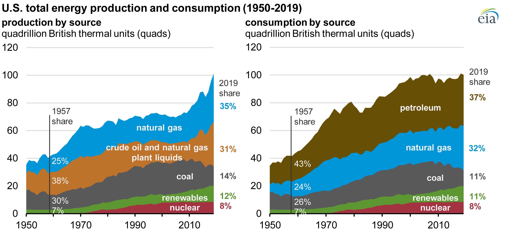

<h1 style="text-align: center;">Are Republicans or Democrats Making Everything Expensive?</h1>

<h2 style="text-align: center;">By: Nolan Cummins</h2>

 

# Introduction

For my final project, I decided to look at the relationship between the ruling party at any given time and the cost of highly valuable goods, like spaghetti. My initial assumption was that Republicans would obviously run the economy into the ground, and although that may appear true when watching the stock market, the actual price of goods tends to be volatile for a year or two before stabilizing after adjusting for inflation. Since large economic decisions typically take time to propagate into significant impacts on commodity pricing, switching from one administration to another makes it difficult to determine if the actions of one truly made everything more expensive. To investigate this, I made two visualizations: a line chart and a geomap. 

---

    

        <vegachart 
            schema-url="../assets/json/visualization1.json?v={{ site.time | date: '%s' }}"
            style="width: 100%;">
        </vegachart>
    

    

        
    

    

        
    

# Who's in charge?
Fundamentally, the government consists of three branches: executive, judicial, and legislative. To determine an objective "ruling party," I took the weighted sum for each branch (including the House and Senate) [3]; whichever holds >51% is considered "in charge." This is shown as the shaded background (red/blue) in the first visualization. After extensive ``Pandas`` data cleaning, I plotted the inflation-adjusted prices of various commodities as a line chart. The bar chart on the right shows the average distribution of the government by party for each branch during the selected years. This provides a clear look at the continuous changes in prices over time alongside political shifts.

This plot explores the relationship between various essential commodities (Gas, Spaghetti, Ice Cream, Bacon, etc.) and the ruling party. Inflation year-over-year is measured by calculating the price increase in a "basket" of goods representative of what Americans consider necessary [2]. Here, we show what each commodity would have cost in 2026 dollars from 1976 onwards. Sadly, there is very little historical data on spaghetti. 

I am primarily interested in whether the ruling party is directly responsible for price increases, such as the recent war in Iran having significant impacts on the price of gasoline. The background is highlighted in red or blue, indicating which political party controls the majority of the government. On the right, we see the specific makeup of the government for a selected range of years. This is useful for identifying periods like a lame-duck presidency, where the legislative branch is split and little can be done, versus periods with a strong hold on power, such as our current administration.

From the chart, we can see large swings occur under both parties. As disappointing as it may seem, there is no significant correlation between the ruling party and the price of goods. The decisions made by various administrations often take years, if not decades, to propagate fully through the system. Consequently, when power is swapped back and forth, the overall net economic impact is washed out, making both parties responsible. For instance, although the price of gas spiked during the Iraq and Afghanistan wars from 2000 to 2008, most other vital goods remained relatively stable. This gas spike can be attributed mostly to conflicts in the Middle East impacting the global oil supply chain—which likely would have happened regardless of the invasion—but we see similar spikes in the 1970s and the 2020s. Both of these latter increases occurred under Democratic regimes, but once again, they were primarily caused by supply chain impacts, such as OPEC cutting off oil and the COVID-19 pandemic, respectively. Rather than claiming one party is worse than the other, it seems that a single massive global event—regardless of political affiliation—affects the price of goods far more than simple political maneuvering in D.C.

### Colormap:
I chose the ``dark2`` colormap because it is a bit more high-contrast than ``tableau10``, and I added a drop-shadow to help the lines stand out against the red and blue shading. Obviously, the red and blue are indicative of Republicans and Democrats, so there wasn't much flexibility there.

---

    <vegachart schema-url="../assets/json/visualization2.json?v={{ site.time | date: '%s' }}" style="width: 100%; max-width: 1000px; display: block; margin: 0 auto;"></vegachart>

    

        
    

# The Ball in the Court:
Considering change happens from the top and takes time to propagate down, I wanted to see if more localized events had any impact. There are two primary ways to enforce laws: violence and the courts. I will ignore violence for now, as it is hard to quantify. Instead, we can look at the distribution of Republican-appointed and Democrat-appointed judges for each state by year to get an idea of which side the courts will favor [1]. A more right-leaning judicial system, for instance, would be more likely to strongly enforce Republican policies and strike down Democrat policies. These decisions could have small impacts on companies and individuals, subsequently affecting how things are priced and demanded by the public. If we zoom out and look at the sum, those small decisions have the potential for wide-sweeping downstream effects. 

For this, I made a map of the United States where each state is shaded according to the political affiliation of its sitting judges during a selected year. On the right, we see the average price of the commodity basket for that same year. This is an important contextual visualization because it highlights long-term trends rather than short-term representative terms. Judges are often life-long appointments, or at the very least, serve for many decades. Furthermore, these are Federally appointed judges, meaning their cases tend to involve significant national matters rather than simple civil suits.

We can observe the "red wave" in the early 2000s as a result of the 9/11 terror attacks, wherein not only the upper echelons of the government were Republican-affiliated, but so were most federal judges. It is difficult, however, to make broad claims. These are simply correlations, and there is no definitive way to prove causation from this data alone. However, it does highlight interesting anomalies: although ice cream remained stable for the past 20 years, when Obama became president, bacon exploded in price to all-time highs. Why? Perhaps increased regulation under a Democratic regime pushed for more humane farming standards, absorbing some of the cost savings of industrial agriculture. Or maybe there were just fewer pigs. Who knows.

### Colormap:
The colormap diverges between red and blue to best show the political lean. This is the standard choice for political maps of the USA.

---

# War

    

Chart sourced from <a href="https://www.statista.com/chartoftheday/">Statista</a>

## Liquid Black Gold:
It is increasingly apparent in today's era that war, particularly in the Middle East, has profound impacts on the economy and gasoline prices. In fact, this realization is what spawned this entire project. Therefore, it is highly pertinent to examine the military status of the U.S. during our time periods of interest. The chart above from Statista [4] shows total defense spending (in 2009 dollars) since 1963. It shows a clear uptick during the early 2000s (Iraq & Afghanistan), providing important context for the other visualizations. During that period of extreme turmoil in the Middle East, we see a clear spike in gas prices from 2000 to 2008, likely a direct result of increased oil prices stemming from the conflicts.

---

# Energy

    

Chart sourced from <a href="https://www.eia.gov/totalenergy/data/monthly/">U.S. Energy Information Administration</a>

## Drill Baby Drill
While war impacts imports, it is also important to examine our production and consumption here at home. The U.S. exports much of its oil, so having an excess amount while still maintaining high gas prices locally may be indicative of an administration prioritizing oil company profits over the wallets of the American people. Conversely, if we do not produce enough, it is best to limit exports to keep domestic prices down. Considering the steady increase in petroleum consumption since the 1950s—with what appears to be a ~6% imbalance between production and consumption as of 2019 seen in the chart above [5]—it appears that the U.S. has no business selling its oil to outside customers when it is not producing enough at home. This unhealthy reliance on oil imports is exactly what leads to large price swings when global supply chains are disrupted.

---

### References

1. Free Law Project. "Bulk Legal Data." *CourtListener*, 2026, [wiki.free.law](https://wiki.free.law/c/courtlistener/help/api/bulk-data/bulk-legal-data). Accessed 11 May 2026.
2. United States, Bureau of Labor Statistics. "Consumer Price Index - All Urban Consumers (Current Series)." *LABSTAT Database*, 2026, [bls.gov/data](https://www.bls.gov/data/). Accessed 11 May 2026.
3. The United States Project. "Members of the United States Congress, 1789-Present." *GitHub*, 2026, [github.com/unitedstates](https://github.com/unitedstates/congress-legislators). Accessed 11 May 2026.
4. Loesche, Dyfed, and Felix Richter. “Infographic: Timeline of Department of Defense Spending.” Statista Daily Data, 2 Mar. 2017, [statista.com](https://www.statista.com/chart/8354/timeline-of-us-budget-allocated-to-the-dod/).
5. *U.S. Energy Production Exceeded Consumption by Record Amount in 2023 - U.S. Energy Information Administration (EIA)*, [eia.gov](https://www.eia.gov/todayinenergy/detail.php?id=62407). Accessed 11 May 2026.

---

 

<h2 style="text-align: center;">Raw Data & Analysis</h2>

    

<h4 style="text-align: center; color: #555;">Raw Dataset Files</h4>

    
    
    
    
    
    
    
    
    

